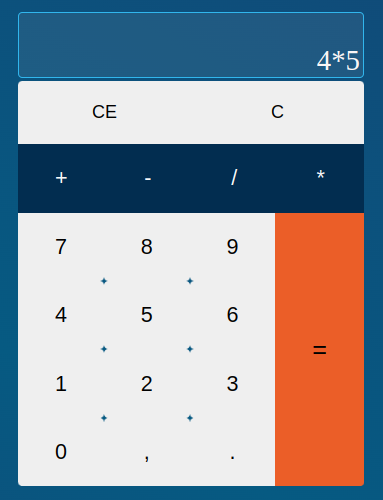

<h1 align="center">
    Challenge 1 - Gama Academy
</h1>
<a href="https://fernandoneto96.github.io/Gama-academy-calculator/">visit website!</a>

In this challenge, the goal was to practice HTMl, CSS and JavaScript skills to build a calculator

  

  

  
